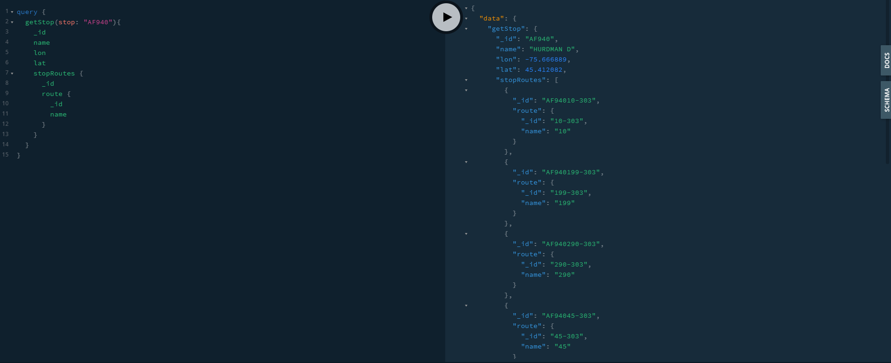
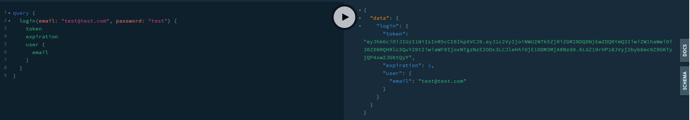
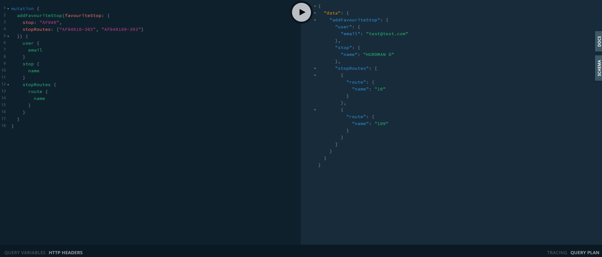
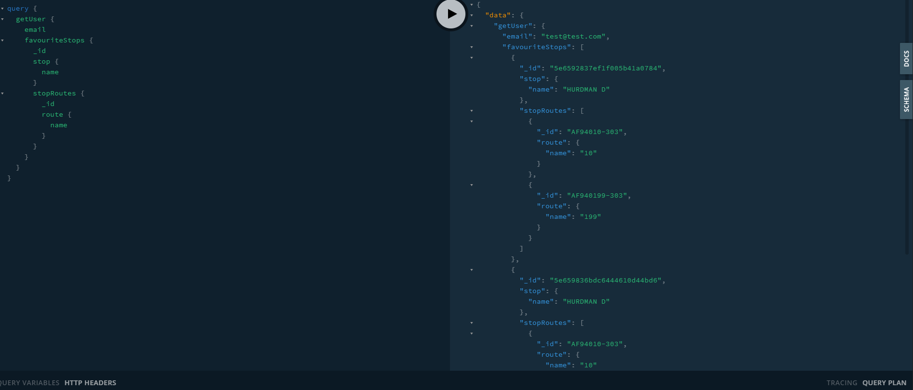

# GraphQL API for GTFS data

GraphQL API for GTFS (General Transit Feed Specification) data created using Apollo-Express-Server.

## Schema

## Example Queries

Getting stop data

Creating a user:

Logging in:

Add a favourite stop:

Get favoutire stops:

## Prototype

Example of a UI where all data can be obtained from one GraphQL query:

