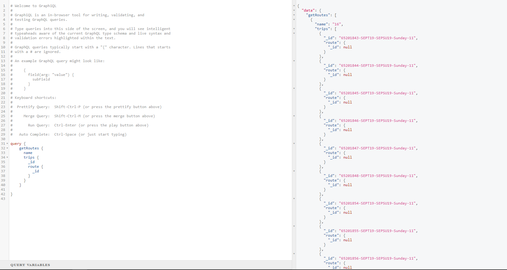

# GraphQL API for GTFS data

GraphQL API for easily obtaining GTFS (General Transit Feed Specification) data created using Node.js and Express.

## Schema

The schema can be found in [api/graphql/schema/index.js](api/graphql/schema/index.js) and see [api/graphql/resolvers/merge.js](api/graphql/resolvers/merge.js) for functions that populate fields. Currently there is a bug in the populate functions that is stopping the second nested query from running properly:

## Prototype

Example of a UI where all data can be obtained from one GraphQL query:

